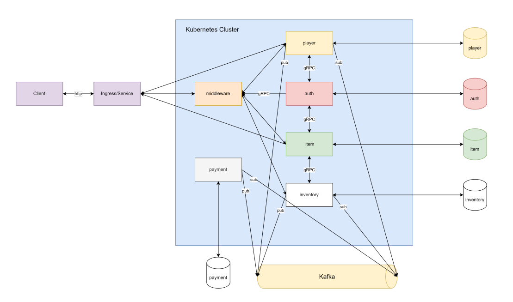

# Boom_Shop
### leaning Go lang

My Project has 5 Services, 5 Database and 1 Message Broker process on Kubernetes Engine

## List Services

- Authentication

- Player

- Item

- Inventory

- Payment
